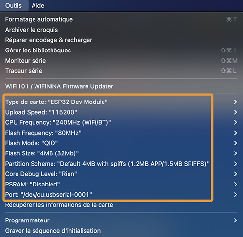
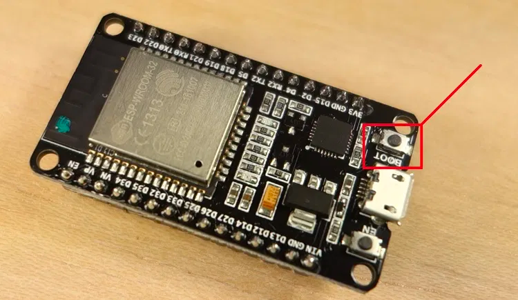
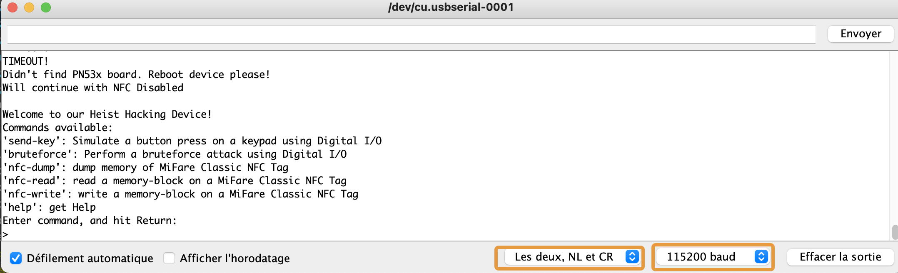

# Arduino 101

## How to flash your Device

### Select the right device

You should select ESP32-Dev Module, with the right Serial port, and an upload speed of 115200 bps (or higher).

### Put your device into bootloader mode

By default, every Arduino Device contains a program. In order to flash it, you need to reset it into Bootloader mode **each time** you want to flash.

On most systems, the Arduino software automatically restarts and enables the bootloader. Sometimes though, it might not work.

If your reset is not automatic, your software should display the following:
**A fatal error occurred: Failed to connect to ESP32: Timed out… Connecting…**

In that case, just do the following on your device:
* Push and hold the BOOT button (it means "BOOTLOADER").
* Press the Upload button in Arduino
* After you see the **“Connecting….”** message in your Arduino IDE, release the finger from the “BOOT” button
* Press the Enable (EN) button on your ESP32 to reboot it.

## How to interact
Your Hacker device uses the Serial Monitor to display and execute commands.

To access the monitor and start interacting with your hacker device, open **Tools -> Serial Monitor**.
In french **Outils -> Moniteur Série**.

In the Serial Monitor, select the right baud rate (115200 bps), and select the line ending behaviour to **Both NL and CR** (equivalent of sending **\n\r** after each time you enter a command and press enter).

Once your device is connected, you should be able to see your CLI appear and interact with commands.
